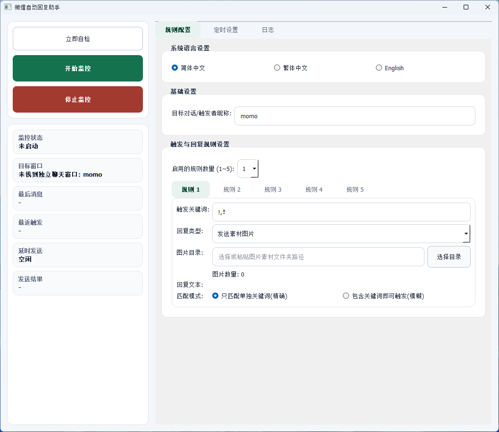
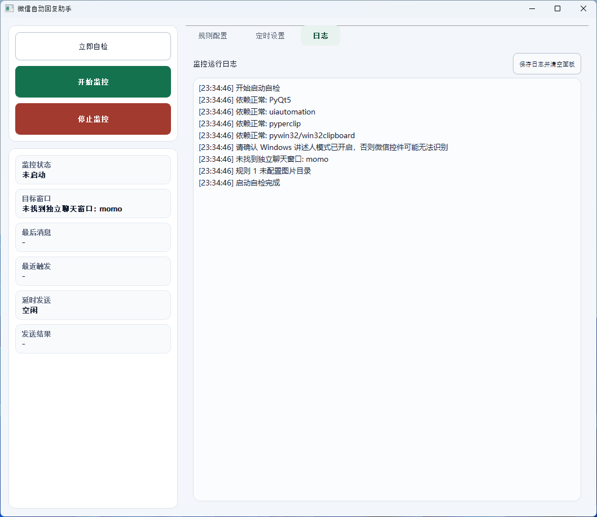
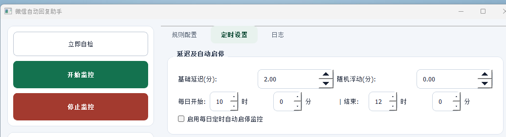

# EasyChat Momo

EasyChat Momo 是一个 PC 微信关键词自动回复助手，用于监听单独拖出的微信聊天窗口，并在最后一条消息命中关键词后自动发送素材图片或指定文本。

当前维护入口是 `wechat_gui_momo.py`，配置文件为 `wechat_config_momo.json`。

## 界面预览

### 规则配置



### 运行日志



### 定时设置



## 功能点

- 支持设置目标对话/触发者昵称，监听独立微信聊天窗口的最新消息。
- 支持最多 5 条自动回复规则，可按需启用 1 到 5 条。
- 每条规则支持多个关键词，关键词使用英文逗号分隔，例如 `!,！`。
- 支持精确匹配和包含匹配两种触发模式。
- 支持两类回复动作：从素材文件夹随机发送图片，或发送指定文本。
- 图片素材会自动统计数量，发送成功后移动到素材目录下的 `sent` 文件夹，避免重复发送。
- 支持基础延迟和随机浮动延迟；延迟期间如果最新消息不再命中规则，会自动取消本次发送。
- 支持每日定时自动开始/停止监控。
- 左侧状态面板实时显示监控状态、目标窗口、最后消息、最近触发、延时状态和发送结果。
- 内置启动自检与运行日志，日志可保存并清空面板，同时持续写入 `logs/app.log`。
- 支持简体中文、繁体中文、English 三种微信控件语言设置。

## 运行

推荐双击：

```text
run_momo.vbs
```

如果窗口闪退或没有反应，双击：

```text
debug_momo.bat
```

调试窗口会停住并显示报错。

## 重新安装依赖

推荐双击：

```text
install_deps.bat
```

也可以手动执行：

```powershell
.venv\Scripts\python.exe -m pip install -r requirements.txt
```

## 运行要求

- 建议在虚拟机中运行，方便保持微信桌面环境长期在线。
- 虚拟机、RDP 或远程桌面窗口不要直接关闭；直接关闭可能导致桌面会话锁定，微信窗口和 `uiautomation` 控件失效。
- 如果需要退出 RDP/远程桌面，建议在管理员命令行中使用 `tscon` 断开远程会话，让桌面会话回到控制台：

```cmd
for /f "skip=1 tokens=3" %s in ('query user %USERNAME%') do %windir%\System32\tscon.exe %s /dest:console
```

- 如果写入 `.bat` 脚本，需要把 `%s` 改成 `%%s`。
- 在实体机上运行时，监控期间不能锁屏、休眠或切换到无法显示微信窗口的状态。
- 微信聊天窗口需要单独拖出，窗口标题要和界面里的“目标对话/触发者昵称”一致。
- Windows 讲述人模式需要开启，否则 `uiautomation` 可能识别不到微信控件。
- 图片规则发送成功后，会移动到素材目录下的 `sent` 文件夹。
- 程序会持续写入 `logs/app.log`，方便回看问题。
